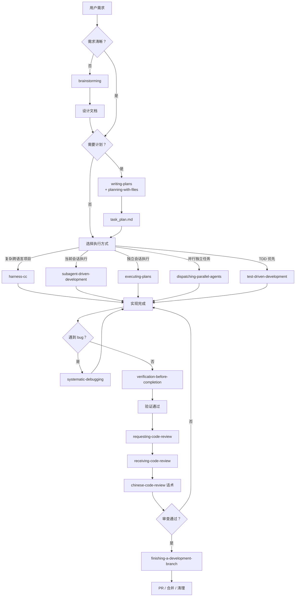
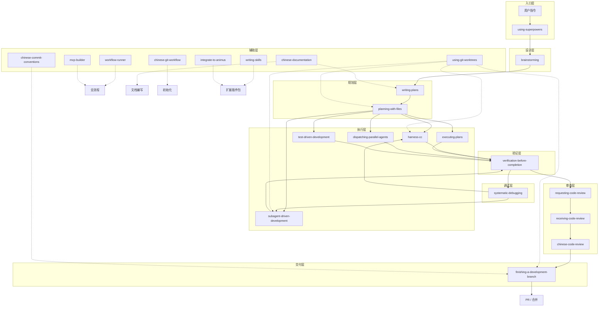

# 开发工作流指南 — animus

## 概述

**animus** 是一个面向 Claude Code 的中文开发工作流插件包，包含 24 个技能，覆盖从需求探索、设计规划、编码实现、调试修复到审查交付的完整开发生命周期。本文档帮助你理解这些技能如何组合使用，在不同场景下选择最合适的路径。

---

## 完整工作流总览

---

## 分阶段说明

### 阶段一：需求探索与设计

**对应技能：** `brainstorming`

- **什么时候用：** 需求模糊、不确定实现方案、需要讨论设计取舍时
- **做什么：** 通过交互式对话探索用户意图，澄清需求，对比多种方案，输出设计文档
- **输出物：** `docs/superpowers/specs/YYYY-MM-DD-<feature-name>-design.md`
- **核心原则：** 任何实现工作开始前必须先完成设计并获得用户批准，即使看起来"很简单"的任务也不例外

### 阶段二：任务规划

**对应技能：** `writing-plans` + `planning-with-files`

这两个技能在规划阶段分工协作：

| 技能 | 职责 | 输出物 |
|------|------|--------|
| **writing-plans** | 将设计文档转化为分步骤的实现计划，明确每个任务要修改的文件、代码范围、测试策略 | `docs/superpowers/plans/YYYY-MM-DD-<feature-name>.md` |
| **planning-with-files** | 创建 `task_plan.md` / `findings.md` / `progress.md` 三件套，提供钩子机制（SHA-256 完整性校验、抗注入），支持会话 `/clear` 后自动恢复 | `task_plan.md` + `findings.md` + `progress.md` |

**工作流程：** writing-plans 产出可执行的计划，planning-with-files 提供运行时追踪和状态持久化。两者通常顺序使用：先用 writing-plans 制定计划，再用 planning-with-files 创建追踪文件来引导执行。

### 阶段三：编码实现

根据项目规模和复杂度，有五种执行路径可选：

| 路径 | 适用场景 | 工作方式 | 技术栈支持 |
|------|---------|---------|-----------|
| **harness-cc** | 复杂项目、多语言、文件数量多、需多轮会话 | 输入 PRD+方案文档，自动拆解任务列表，状态机推进，含验收后自动提交。自带 PreCompact/Stop 钩子实现会话持久化 | C++/Qt, Python, Node.js, Rust, Go |
| **subagent-driven-development** | 当前会话内可拆解的任务 | 每个子任务分派一个全新 subagent，完成后执行两阶段审查（先规格合规性，再代码质量） | 所有 |
| **executing-plans** | 需要独立隔离会话执行有计划的任务 | 加载计划 -> 批判性审查 -> 按步骤执行 -> 审查检查点 -> 完成报告 | 所有 |
| **dispatching-parallel-agents** | 2 个以上完全独立、无共享状态的任务 | 并行分派多个 subagent，各自独立执行，最后汇总结果 | 所有 |
| **test-driven-development** | 功能实现或 bug 修复，测试先行 | 先写测试 -> 看测试失败 -> 写最少代码通过 -> 重构。可与其他路径组合使用 | 所有 |

**TDD 集成说明：** `test-driven-development` 是一个跨切面的技能。`harness-cc` 内部已集成 TDD 循环，其他执行路径也推荐在子任务级别遵循红-绿-重构节奏。

### 阶段四：调试与修复

**对应技能：** `systematic-debugging`

- **什么时候用：** 测试失败、bug 复现、异常行为、性能问题
- **标准流程：**
  1. **复现** — 稳定复现 bug 或失败场景
  2. **定位根因** — 系统性地缩小排查范围，而不是"改改看"
  3. **修复** — 提出修复方案并实施
  4. **验证** — 确认修复有效且没有引入回归
- **与其他技能的关系：** 调试完成后有两种走向——修复成功则进入验证阶段，修复过程中发现需要大改则回到编码阶段

### 阶段五：验证与审查

**涉及技能：** `verification-before-completion` → `requesting-code-review` → `receiving-code-review` + `chinese-code-review`

逐级关卡：

1. **verification-before-completion** — 在声称"完成"之前运行所有验证命令（编译、测试、lint），确认输出正确。这是自我检查环节
2. **requesting-code-review** — 提交正式的代码审查请求，包含变更摘要、审查要点、测试结果
3. **receiving-code-review** — 接收审查反馈后的处理流程，指导如何理解和响应审查意见
4. **chinese-code-review** — 提供中文 Code Review 话术模板，包含分级标注（P0/P1/P2）、问题分类和标准化回复模板。仅在以 `/chinese-code-review` 命令调用时触发

**小技巧：** 在 `requesting-code-review` 之前先运行 `verification-before-completion`，可以避免因为测试没通过而被审查者打回。

### 阶段六：收尾交付

**对应技能：** `finishing-a-development-branch`

- **做什么：** 合并代码、创建 Pull Request、清理临时分支、更新 CHANGELOG
- **前置条件：** 所有测试通过、代码审查通过
- **输出物：** PR（含标题、描述、测试计划）、已合并的目标分支、已清理的临时分支

---

## 贯穿全流程的工具技能

以下技能可以在开放流程的任意阶段使用，它们不专属于某个环节：

| 技能 | 用途 | 适用阶段 |
|------|------|---------|
| **using-superpowers** | 入口技能，建立查找和使用其他技能的规则。首次进入新项目时触发 | 全流程起始 |
| **using-git-worktrees** | 在隔离的工作树中开发，避免分支切换带来的上下文冲 | 编码、审查、调试 |
| **workflow-runner** | 执行预定义的 YAML 工作流定义，自动化重复性流程 | 全流程 |
| **mcp-builder** | 构建生产级 MCP 服务器，为项目增加外部工具集成能力 | 需要外部工具的任意阶段 |
| **chinese-documentation** | 中文文档排版规范参考（标点、空格、术语），仅在以 `/chinese-documentation` 命令调用时触发 | 文档编写、注释补充 |
| **chinese-commit-conventions** | 中文 Conventional Commits 配置规范，仅在以 `/chinese-commit-conventions` 命令调用时触发 | 提交代码时 |
| **chinese-git-workflow** | 国内 Git 平台（Gitee、Coding.net 等）的配置参考，仅在以 `/chinese-git-workflow` 命令调用时触发 | 项目初始化 |
| **writing-skills** | 创建、编辑和优化技能，包括评估测试 | 扩展插件包、自定义技能 |
| **integrate-to-animus** | 将新技能、工具或配置集成到 animus 插件包中 | 扩展插件包 |

---

## 典型工作流场景示例

### 场景 A：新功能开发（完整流程）

这是最全面的路径，适合新功能或较大改动：

1. **用户提出需求** — 需求可能不完整或不清晰
2. **brainstorming** — 探索需求，设计技术方案，输出设计文档
3. **writing-plans + planning-with-files** — 将设计方案分解为可执行的任务列表，创建追踪文件
4. **选择执行路径**：
   - 跨语言复杂项目 -> **harness-cc**
   - 当前会话可完成 -> **subagent-driven-development**
   - 需要隔离会话 -> **executing-plans**
5. **遇到 bug 时** -> **systematic-debugging** -> 回到步骤 4
6. **verification-before-completion** — 全面验证
7. **requesting-code-review** — 提交审查
8. **receiving-code-review** — 处理审查意见
9. **finishing-a-development-branch** — 合并、清理

### 场景 B：快速修复（最小路径）

适合简单的 bug 修复或小改动：

1. **test-driven-development** — 先编写复现 bug 的测试
2. **实现修复代码** — 写最少代码让测试通过
3. **verification-before-completion** — 确认修复有效、没有回归
4. **提交代码** — 使用 chinese-commit-conventions 规范提交信息

### 场景 C：复杂多模块项目

适合大型功能涉及多个独立模块：

1. **brainstorming** — 整体架构设计，划分模块边界
2. **writing-plans** — 为每个模块制定独立计划
3. **dispatching-parallel-agents** — 多个模块并行开发，每个模块使用独立 subagent
4. **每个模块独立验证** — 模块级 verification-before-completion
5. **整体集成验证** — 跨模块联调
6. **requesting-code-review** — 统一提交整体审查
7. **finishing-a-development-branch** — 统一合并

### 场景 D：种子项目 / TDD 先行

适合从零开始的项目，希望在早期建立质量基线：

1. **brainstorming** — 确定整体架构和技术选型
2. **writing-plans** — 规划项目骨架和初始化任务
3. **test-driven-development** — 从核心接口开始，先定义测试
4. **subagent-driven-development** — 按模块逐一实现
5. **harness-cc**（可选）— 当项目增长到多文件多语言时切换到状态机工作流
6. **verification-before-completion** — 全面回归测试
7. **finishing-a-development-branch** — 初始化 CI/CD 配置并交付

---

## 技能依赖关系图

---

## 何时使用哪个技能——快速判断表

| 你的状态 | 推荐入口技能 |
|---------|------------|
| 需求很模糊，不知道怎么做 | `brainstorming` |
| 有明确需求，需要落地计划 | `writing-plans` + `planning-with-files` |
| 多语言/文件数多，需要持久化执行 | `harness-cc` |
| 当前会话里有几个独立任务 | `subagent-driven-development` |
| 需要专门开一个隔离会话来干活 | `executing-plans` |
| 多个完全独立的功能并行开发 | `dispatching-parallel-agents` |
| 想先写测试再写代码 | `test-driven-development` |
| 遇到 bug，需要系统排查 | `systematic-debugging` |
| 实现完成，需要确认没漏东西 | `verification-before-completion` |
| 准备合并，需要代码审查 | `requesting-code-review` |
| 收到审查意见不知道怎么改 | `receiving-code-review` |
| 准备分支收尾、提交 PR | `finishing-a-development-branch` |
| 想隔离开发，不干扰当前分支 | `using-git-worktrees` |

---

## 最佳实践建议

1. **不要跳过设计阶段。** `brainstorming` 设有一个硬性门控（HARD-GATE）：在展示设计方案并获得用户批准之前，不得编写任何代码。简单项目只需要几分钟设计对话——但这一步不能省。

2. **规划先行，追踪跟上。** `writing-plans` 产出计划文档后，立即用 `planning-with-files` 创建追踪文件。planning-with-files 的钩子系统会在每次工具调用前校验计划完整性，防止注入式攻击；每次 `/clear` 后自动恢复上下文。

3. **选择合适的执行路径。** 如果项目涉及 C++/Qt、Python、Node.js、Rust 或多语言混合，请优先考虑 `harness-cc`——它的状态机引擎、PreCompact 进度刷写和 Stop 钩子恢复提示专门为跨会话复杂项目设计。

4. **调试要系统，不要猜。** 遇到 bug 时不要直接修改代码，使用 `systematic-debugging` 先定位根因。该技能强制要求复现 -> 定位 -> 修复 -> 验证的完整闭环。

5. **每次声称"完成"前，先验证。** `verification-before-completion` 是防止遗漏的最后一道防线——它会运行所有测试、编译检查、lint 检查，并对比预期输出与实际输出。

6. **审查是双向的。** 提交审查前先用 `requesting-code-review` 梳理变更要点；收到反馈后用 `receiving-code-review` 处理评审意见，必要时用 `chinese-code-review` 提供中文话术模板。

---

## 相关资源

- [插件开发指南](./plugin-development-guide.md) — 如何扩展和发布 animus
- [配置模板](../config-templates/) — settings.json 和 MCP 配置示例
- [安装脚本](../scripts/setup.ps1) — 自动配置脚本
